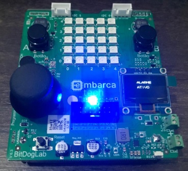

# 📌 Projetos de Sistemas Embarcados - EmbarcaTech 2025

Autor: **Rafael Florentino Barbosa**

Curso: Residência Tecnológica em Sistemas Embarcados

Instituição: EmbarcaTech - HBr

Campinas, março de 2025

---

## 📚 Sobre este repositório

Este repositório reúne os projetos desenvolvidos ao longo do curso de Sistemas Embarcados, durante a etapa de residência.  

Cada projeto tem sua própria pasta, contendo o código-fonte, documentação e recursos visuais.

---

## ❓ O que fazer com este arquivo

Ao fazer o *fork* do repositório, o aluno está livre para modificar este arquivo como quiser dentro do seu próprio *fork*.

## 📷 Setup Utilizado

## 🔗 Projetos
- [Alarme Inteligente](https://github.com/rafaelflorentinobarbosa/ProjetoAlarme)

## 📜 Licença
MIT License - MIT GPL-3.0.