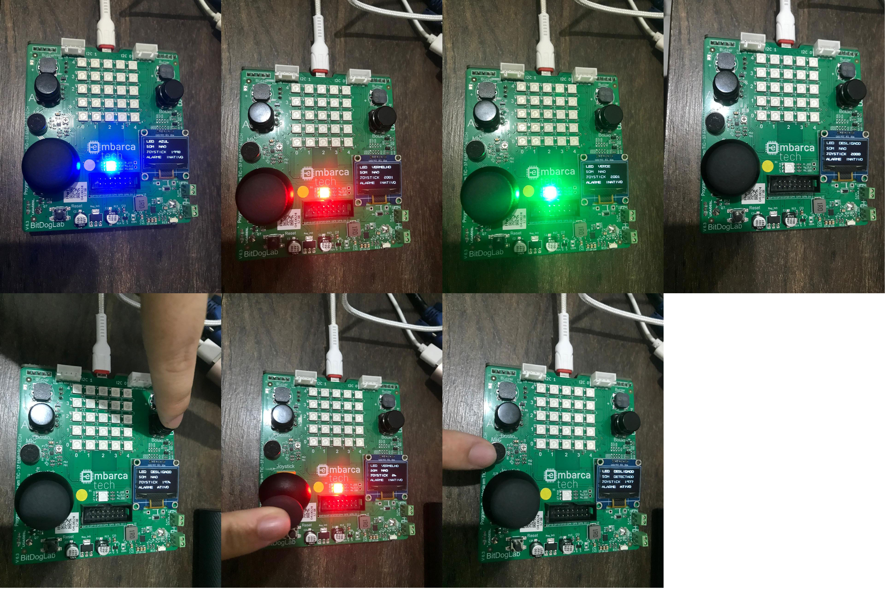

# 🔧 Tarefa: Roteiro de FreeRTOS #2 - EmbarcaTech 2025

👨‍💻 **Autor:** Rafael Florentino Barbosa  
🎓 **Curso:** Residência Tecnológica em Sistemas Embarcados  
🏫 **Instituição:** EmbarcaTech - HBr  
📍 **Local:** Brasília, junho de 2025  

---

## 📌 Descrição do Projeto

Este projeto utiliza o sistema operacional de tempo real **FreeRTOS** em conjunto com a placa **BitDogLab (Raspberry Pi Pico W)** para implementar controle multitarefa de periféricos diversos. Cada componente (LED RGB, buzzer, microfone, joystick e display OLED) é controlado por uma **task independente**, promovendo modularidade e concorrência.

---

## ⚙️ Funcionalidades

- 🎨 **LED RGB**: alterna entre as cores azul, verde, vermelho e desligado com o botão A.
- 🚨 **Alarme sonoro (buzzer)**: reproduz uma sirene intermitente ativada/desativada com o botão B.
- 🎤 **Microfone**: detecta sons acima de um limiar e atualiza o estado no display.
- 🕹️ **Joystick**: lê posição analógica e mostra valor no display.
- 🖥️ **Display OLED**: mostra status dos sensores e atuadores em 4 linhas (LED, som, joystick e alarme).

---

## 🧠 Organização do Código

📁 **Estrutura de pastas**:

```
Freetos2/
├── app/ # Arquivo main.c com criação das tasks
├── drivers/ # Código dos periféricos (buzzer, display, leds etc.)
├── hal/ # Camada de abstração de hardware (opcional)
├── include/ # Headers com definições dos drivers
├── FreeRTOS-Kernel/ # Kernel do FreeRTOS
└── CMakeLists.txt # Arquivo de build

```

📄 **Principais arquivos**:

- `main.c`: inicialização do sistema e criação das tasks
- `buzzers.c / buzzers.h`: controle por PWM do buzzer com tom ajustável
- `led.c / led.h`: controle do LED RGB
- `display.c / display.h`: atualização e renderização no display OLED SSD1306
- `joystick.c / joystick.h`: leitura do joystick analógico e botão central
- `microphone.c / microphone.h`: detecção simples de som com ADC

---

## 🕹️ Controles

| Componente | Ação | Botão |
|------------|------|-------|
| LED RGB    | Alterna cor | A |
| Buzzer     | Ativa/desativa alarme | B |
| Joystick   | Movimenta e mostra valor X | - |
| Microfone  | Detecta som e exibe no display | - |

---

## 📷 Exibição no Display

- LED: Azul
- Som: Detectado
- Joystick: 2345
- Alarme: Ativo





---

## 🛠️ Tecnologias Utilizadas

- FreeRTOS ⏱️
- Raspberry Pi Pico W (BitDogLab)
- I2C, ADC, PWM, GPIO
- SSD1306 OLED
- CMake + Toolchain para RP2040
- VS Code + Pico SDK

---

## 📜 Licença
GNU GPL-3.0.

## 🙌 Agradecimentos
Projeto realizado como parte da trilha de aprendizagem prática da EmbarcaTech 2025.


