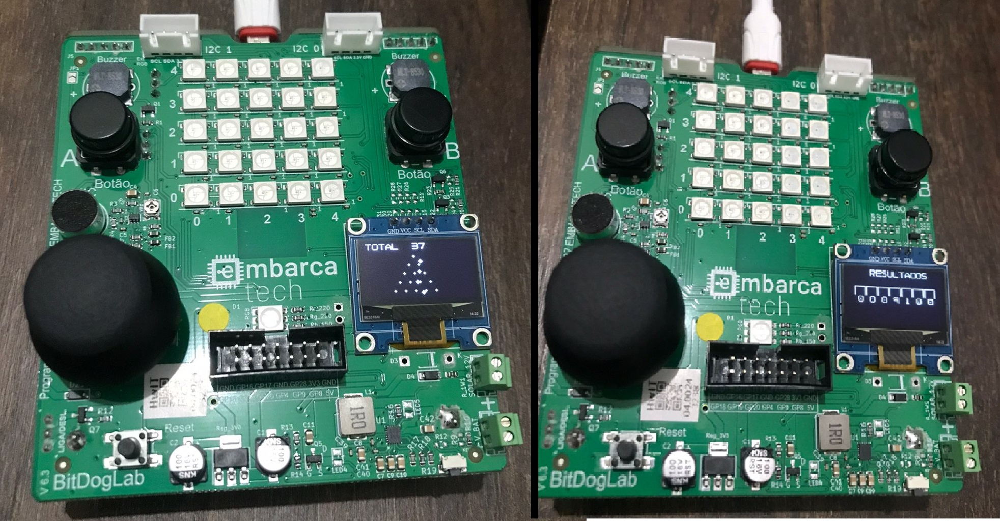

# 🎯 Galton Board OLED – Simulador com Display e Histograma  



**Autor:** Rafael Florentino  
**Curso:** Residência Tecnológica em Sistemas Embarcados
**Instituição:** SEmbarcaTech – HBr
**Local:** Brasília - DF  

---

## 🧠 Descrição do Projeto

Este projeto implementa uma **Galton Board virtual** utilizando o microcontrolador **RP2040** (Raspberry Pi Pico) com um **display OLED I²C 128x64 pixels**, conectado por meio da placa **BitDogLab**.

A simulação representa a queda de bolas em um tabuleiro triangular de pinos, desviando aleatoriamente para a esquerda ou direita. As bolas acumulam-se nas canaletas inferiores, formando uma **distribuição normal**.

---

## 📺 Modos de Exibição

🔁 O sistema possui **duas telas comutáveis** pressionando um botão físico:

- 🟢 **Tela 1: Simulação ao vivo**  
  Exibe as bolas descendo em tempo real, os pinos, o contador total de bolas lançadas e a animação.

- 📊 **Tela 2: Histograma vertical (Resultados)**  
  Exibe o número acumulado de bolas em cada bin (canaleta) após pausar a simulação.

---

## 📁 Estrutura do Projeto


```
├── app/
│   └── galton_board.c 
├── hal/
│   ├── hal_display.c 
│   └── hal_button.c
├── drivers/
│   ├── ssd1306.h
│   ├── ssd1306_i2c.c 
│   ├── ssd1306_font.h
│   └── ssd1306_i2c.h
├── include/
│   ├── config.h
│   ├── hal_display.h
│   └── hal_button.h
```

## 🛠️ Tecnologias e Componentes

- 📦 **Raspberry Pi Pico (RP2040)**
- 💡 **Display OLED SSD1306 (128x64px)**
- 🔌 **Interface I²C (GPIO 14 e 15)**
- 🔘 **Botão físico** (para alternar modos)
- 🔤 **Linguagem C com SDK oficial da Raspberry Pi**
- ⚙️ **BitDogLab** (como base integrada com sensores e conectividade)

---

## 🚀 Como Executar

1. Clone o repositório:
   ```bash
   git clone https://github.com/rafaelflorentinobarbosa/rafael_florentino_embarcatech_HBr_2025/tree/main/galton-board