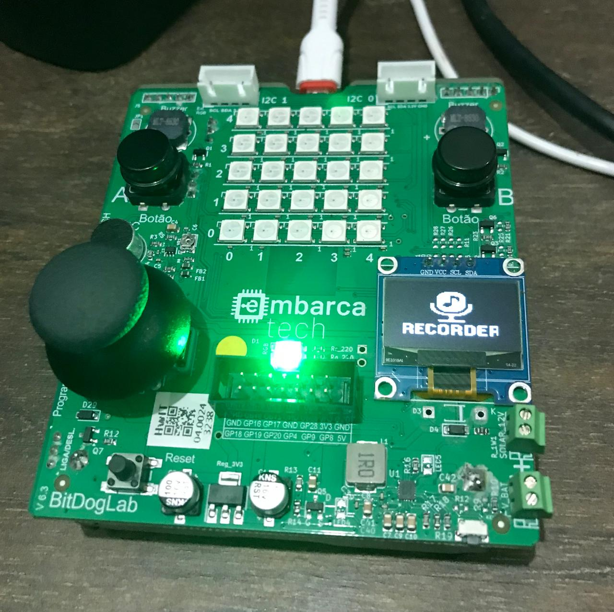

# Projetos de Sistemas Embarcados - EmbarcaTech 2025

Autor: **Rafael Florentino Barbosa**

Curso: Residência Tecnológica em Sistemas Embarcados

Instituição: EmbarcaTech - HBr

Brasília 2025.

---



🎯 Descrição do Projeto
Este projeto foi desenvolvido como parte do curso de Residência Tecnológica em Sistemas Embarcados da EmbarcaTech - HBr.
O objetivo é implementar um sistema embarcado capaz de gravar e reproduzir áudio utilizando um microfone, memória interna e buzzers, com interface interativa por botões, LEDs e display OLED.

⚙️ Funcionalidades
🎤 Gravação de áudio por microfone (GPIO 28 - ADC2) usando DMA.

🔊 Reprodução de áudio via PWM nos buzzers soldados nos GPIOs 21 e 10.

🖥️ Interface gráfica com display OLED SSD1306 via I2C.

🔘 Controle por botões físicos (GPIOs 5 e 6).

💡 Feedback visual com LEDs RGB (verde, vermelho e azul).

🧠 Arquitetura modular, organizada em camadas (hal, drivers, app e include).

🧱 Estrutura do Projeto

```
📁 projeto/
├── app/
│   └── main.c
├── drivers/
│   ├── ssd1306_i2c.c
│   ├── ssd1306_font.h
│   ├── ssd1306_i2c.h
│   └── ssd1306.h
├── hal/
│   ├── buttons.c
│   ├── led.c
│   ├── display.c
│   ├── microphone.c
│   └── buzzers.c
├── include/
│   ├── display.h
│   ├── microphone.h
│   ├── buzzers.h 
│   ├── buttons.h
│   ├── logo_bitmap.h
│   └── led.h
├── CMakeLists.txt
├── README.md
└── LICENCE

```

🛠️ Tecnologias e Ferramentas
🧠 Placa: BitDogLab (baseada em Raspberry Pi Pico W)

⌨️ Linguagem: C (pico-sdk)

💾 DMA + ADC para captura de áudio

🧰 PWM para reprodução

🖼️ Display OLED com driver SSD1306

⚙️ CMake para build do projeto

▶️ Como Usar
🔌 Conecte a placa ao seu computador.

🧱 Compile o projeto com CMake e o SDK do Raspberry Pi Pico.

🔄 Faça upload do binário para a placa.

🟢 Ao iniciar, o sistema mostrará uma tela de boas-vindas.

🔴 Pressione o botão A para começar a gravação.

⏹️ Pressione o mesmo botão A novamente para parar.

🔵 Pressione o botão B para reproduzir o áudio gravado.


💡 Aprendizados
Manipulação de sinais analógicos com ADC e PWM.

Uso de DMA para alta performance na coleta de dados.

Implementação de máquina de estados finita (FSM) para controle do fluxo.

Modularização e reaproveitamento de código embarcado.

🤝 Agradecimentos
A todos os instrutores da EmbarcaTech - HBr, colegas de turma e à comunidade open-source por ferramentas incríveis como o pico-sdk e bibliotecas para o display SSD1306.

📜 Licença
Distribuído sob os termos da licença GNU GPL-3.0.
Consulte o arquivo LICENSE para mais informações.

